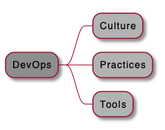
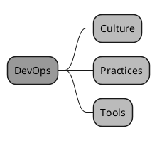
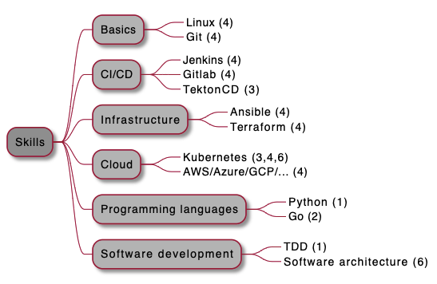
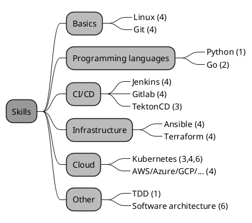

# DevOps-Engineer

Notes and links useful for DevOps Engineer

## DevOps skills

3 pillars of DevOps:



Code for picture: 



3 pillars based on image from https://www.predicagroup.com/blog/azure-devops/:


Top DevOps skills 2021:



1. https://github.com/sebastianczech/Design-Patterns-In-Python
2. https://github.com/sebastianczech/API-golang
3. https://github.com/sebastianczech/Cloud-Native-CI-CD
4. https://github.com/sebastianczech/Learning-CI-CD
5. https://github.com/sebastianczech/Modern-Software-Architect
6. https://github.com/sebastianczech/DevOps-Engineer

Code for picture:



## Azure Microsoft Learn

### [AZ-104 - Microsoft Certified: Azure Administrator Associate](https://docs.microsoft.com/en-gb/learn/certifications/azure-administrator)

#### Azure CLI

```
az --version  

az find "az vm"
az find "az vm create"  

az find blob
az storage blob --help

az login

az group create --name <name> --location <location>
az group list

export RESOURCE_GROUP=learn-***
export AZURE_REGION=centralus
export AZURE_APP_PLAN=popupappplan-$RANDOM
export AZURE_WEB_APP=popupwebapp-$RANDOM

az group list --output table
az group list --query "[?name == '$RESOURCE_GROUP']"

az appservice plan create --name $AZURE_APP_PLAN --resource-group $RESOURCE_GROUP --location $AZURE_REGION --sku FREE
az appservice plan list --output table

az webapp create --name $AZURE_WEB_APP --resource-group $RESOURCE_GROUP --plan $AZURE_APP_PLAN
az webapp list --output table
curl $AZURE_WEB_APP.azurewebsites.net

az webapp deployment source config --name $AZURE_WEB_APP --resource-group $RESOURCE_GROUP --repo-url "https://github.com/Azure-Samples/php-docs-hello-world" --branch master --manual-integration
curl $AZURE_WEB_APP.azurewebsites.net
```

* [JMESPath - a query language for JSON](https://jmespath.org/)

### [AZ-204 - Microsoft Certified: Azure Developer Associate](https://docs.microsoft.com/en-gb/learn/certifications/azure-developer)

### [AZ-400 - Microsoft Certified: DevOps Engineer Expert](https://docs.microsoft.com/en-gb/learn/certifications/devops-engineer)

### [Evolve your DevOps practices](https://docs.microsoft.com/pl-pl/learn/paths/evolve-your-devops-practices/)

* **Value stream map (VSM)** - helps you analyze your current release cycle process
* Customer value metrics - **Total lead time** is the time it takes for a feature to make it to the customer. **Process time**i s the time spent on a feature that has value to the customer. **The activity ratio** is process time divided by total lead time: ``ActivityRatio = ProcessTime/TotalLeadTime``
* [Azure DevOps services](https://azure.microsoft.com/en-us/services/devops)
    * Azure Boards
    * Azure Pipelines
    * Azure Test Plans
    * Azure Repos
    * Azure Artifacts
* [What features and services do I get with Azure DevOps?](https://docs.microsoft.com/en-us/azure/devops/user-guide/services?view=azure-devops&viewFallbackFrom=azure-devops%3Fazure-portal%3Dtrue)    
* [DevOps Resource Center](https://docs.microsoft.com/en-us/azure/devops/learn/)
* Elite performers:
    * Deploy more frequently
    * Reduce lead time from commit to deploy
    * Reduce change failure rate
    * Recover from incidents more quickly
* [DevOps](https://docs.microsoft.com/en-us/azure/devops/learn/what-is-devops) - The union of people, process, and products to enable continuous delivery of value to our customers
* [DevOps at Microsoft](https://docs.microsoft.com/en-us/azure/devops/learn/devops-at-microsoft/)
* Key Performance Indicators (KPIs) and quality metrics:
    * Faster Outcomes
        * Deployment Frequency
        * Deployment Speed
        * Deployment Size
        * Lead Time
    * Efficiency
        * Server to Admin Ratio
        * Staff Member to Customers Ratio
        * Application Usage
        * Application Performance
    * Quality and Security
        * Deployment Failure Rates
        * Application Failure Rates
        * Mean Time to Recover
        * Bug Report Rates
        * Test Pass Rates
        * Defect Escape Rate
        * Availability
        * SLA Achievement
        * Mean Time to Detection
    * Culture
        * Employee Morale
        * Retention Rates
* Common quality metrics
    * Failed Builds Percentage 
    * Failed Deployments Percentage 
    * Ticket Volume 
    * Bug Bounce Percentage 
    * Unplanned Work Percentage 
* Azure Boards is a tool in Azure DevOps to help teams plan the work that needs to be done. 
* Agile Manifesto states - responding to change comes before following a plan
* A sprint is a fixed amount of time a team has to complete a set of tasks
* Delivery Plans is an extension for Azure DevOps that helps organizations plan and review work schedules across multiple teams. It's a visualization of one or more work schedules against a calendar backdrop.
* Creating a delivery plan can be valuable at any point in a project.

### [Build applications with Azure DevOps learning path](https://docs.microsoft.com/en-us/learn/paths/build-applications-with-azure-devops/)

* **Azure Pipelines** is a cloud service that you can use to automatically build, test, and deploy your code project.
* Continuous integration (CI) is the process of automating the build and testing of code every time a team member commits changes to version control. 
* A pipeline defines the continuous integration process for the app. It's made up of steps called tasks. The pipeline runs when you submit code changes.
* A build agent builds or deploys the code. When your build or deployment runs, the system begins one or more jobs. An agent is installable software that runs one build or deployment job at a time. 
* The final product of the pipeline is a build artifact.
* Instead of managing each agent individually, you can organize agents into agent pools. An agent pool defines the sharing boundary for all agents in that pool. 
* Service endpoints are a way for Azure DevOps to connect to external systems or services. They are a bundle of securely stored properties that includes but is not limited to:
  * Service name
  * Description
  * Server URL
  * Certificates or tokens
  * User names and passwords
* Pipeline as code refers to the concept of expressing your build definitions as code. 
* A template enables you to define common build tasks one time and reuse those tasks multiple times. You call a template from the parent pipeline as a build step. You can pass parameters into a template from the parent pipeline.
*  Version control system:
   * centralized (e.g. Team Foundation Version Control (TFVC))
   * distributed (e.g. GIT)
* Clone is your local copy of a repository
* Branching - where you can maintain as many copies as you want and merge back only the one you want to keep. Main branch, or trunk, is typically called master
* When your code is ready to be merged into the master branch in the main repository that's shared by all developers, you create what's called a pull request. When you create a pull request, you're telling the other developers that you have code ready to review and you want it merged into the master branch. When your pull request is approved, it becomes part of the master codebase.
* Git commands:
  * Create a Git repository:	``git init``
  * Download a remote repository:	``git clone``
  * Create a branch:	``git checkout``
  * See which files have been changed:	``git status``
  * Stage files to commit:	``git add``
  * Commit files to your branch:	``git commit``
  * Download a branch from a remote repository:	``git pull``
  * Upload a branch to a remote repository:	``git push``
* Origin specifies your repository on GitHub. When you fork code from another repository, it's common to name the original remote (the one you forked from) as upstream.
* By default, a build is triggered when a change is pushed to any file on any branch.
* A continuous integration (CI) build is a build that runs when you push a change to a branch.
* A pull request (PR) build is a build that runs when you open a pull request or when you push additional changes to an existing pull request.
* PR builds help you verify that your proposed changes will work correctly after they're merged to master or another target branch. The final CI build verifies that the changes are still good after the PR was merged.
* Badge - it's important for members of the team to know the status of the build. An easy way to quickly determine the build status is to add a build badge to the README.md file on GitHub. A badge is part of Microsoft Azure Pipelines. It has methods you can use to add an SVG image that shows the status of the build on your GitHub repository. Most GitHub repositories include a file named README.md, which is a Markdown file that includes essential details and documentation about your project. GitHub renders this file on your project's home page.
* Dashboard is a customizable area in Azure DevOps where you can add widgets and extensions to help you visualize areas of your DevOps solution. 
* [Git](https://git-scm.com/)
* [GitHub Desktop](https://desktop.github.com/)
* [Understanding the GitHub flow](https://guides.github.com/introduction/flow/)
* [A successful Git branching model](https://nvie.com/posts/a-successful-git-branching-model/)
* [How to Split Pull Requests – Good Practices, Methods and Git Strategies](https://www.thedroidsonroids.com/blog/splitting-pull-request)
* [How to Write a Git Commit Message](https://chris.beams.io/posts/git-commit/)
* [Specify events that trigger pipelines](https://docs.microsoft.com/en-us/azure/devops/pipelines/build/triggers?view=azure-devops&tabs=yaml)
* Branch strategies:
  * Feature Branch Workflow
  * [Gitflow Workflow](https://www.atlassian.com/git/tutorials/comparing-workflows/gitflow-workflow)
  * Forking Branch Workflow
* Branch policies help you to protect your important Git branches. Policies enforce your team's code quality and change management standards. Some examples of the policies you can configure include: the minimum number of reviewers, checking for linked work items, checking for comment resolution, enforcing a merge strategy, and checking for build validation.
* Pull request strategies - add additional conditions to your pull requests to enforce a higher level of code quality in your key branches. A clean build of the merged code and approval from multiple reviewers are some extra requirements you can set to protect your key branches
* Automated tests - documentation and the ability to more easily refactor your code are two added benefits of automated testing.
* Test pyramid
* Continuous testing means tests are run early in the development process and as every change moves through the pipeline. 
* Shifting left means considering software quality and testing earlier in the development process.
* What makes a good test?
  * Don't test for the sake of testing
  * Keep your tests short
  * Ensure that your tests are repeatable
  * Keep your tests focused
  * Choose the right granularity
* Security and license ratings in open-source software:
  * [Black Duck](https://www.blackducksoftware.com/) - Black Duck  by Synopsys scans your open-source dependencies against their own database. They keep that database up-to-date with the latest vulnerabilities and give you timely information on fixes, workarounds, and on the exploits. They cover over 80 programming languages, and get their information from many sources.
  * [GitLab](https://about.gitlab.com/) - GitLab  is a CI/CD pipeline tool that enables you to scan the dependencies in code that comes from GitLab repositories. It supports JavaScript, Ruby, Python, PHP, and Java. Their Azure Pipelines extension  enables you to add a GitLab repository as a source.
  * [Sonatype Nexus](https://www.sonatype.com/nexus-repository-sonatype) - Sonatype Nexus  scans your dependencies for known vulnerabilities, licenses, and old or unsupported components. Their Azure Pipelines extension  enables you to upload your artifacts to Sonatype Nexus for scanning.
  * [Veracode](https://www.veracode.com/) - Veracode  is a code scanning tool that integrates with Azure Pipelines to help you find vulnerabilities early in the development process. Their Azure Pipelines extension  stops the build process if there's a severe security risk and gives you guidance on finding and fixing the vulnerability.
  * [WhiteSource Bolt](https://bolt.whitesourcesoftware.com/) - WhiteSource Bolt  is a tool for scanning open-source dependencies for vulnerabilities and licensing. It supports more than 200 programming languages and gives guidance on fixing the vulnerabilities. There are reports for vulnerabilities, licensing, and inventory. Their Azure Pipelines extension  allows for extensive policy configuration as well as viewing the results from the Azure Pipelines portal.
* [What is a public project?](https://docs.microsoft.com/en-us/azure/devops/organizations/public/about-public-projects?view=azure-devops)
* [Quickstart: Change the project visibility, public or private](https://docs.microsoft.com/en-us/azure/devops/organizations/public/make-project-public?view=azure-devops)
* [Setting repository visibility](https://help.github.com/github/administering-a-repository/setting-repository-visibility)
* [Pipeline - specify conditions](https://docs.microsoft.com/en-us/azure/devops/pipelines/process/conditions?view=azure-devops&tabs=yaml)
* [Security Content Automation Protocol - SCAP](https://csrc.nist.gov/projects/security-content-automation-protocol)
* [Semantic Versioning](https://semver.org/)
* [Deep dive into Azure Artifacts](https://azure.microsoft.com/blog/deep-dive-into-azure-artifacts/)
* Elements of a dependency management strateg - A good dependency management strategy depends on these three elements:
  * Standardization - Standardizing how you declare and resolve dependencies will help your automated release process remain repeatable and predictable.
  * Packaging formats and sources - Each dependency should be packaged using the applicable format and stored in a central location.
  * Versioning - You need to keep track of the changes that occur over time in dependencies just as you do with your own code. This means that dependencies should be versioned.
* Identify dependencies:
  * Duplicate code.
  * High cohesion and low coupling.
  * Individual lifecycle.
  * Stable parts.
  * Independent code and components.
* Feeds in Azure Artifacts have three different views by default. These views are added at the moment a new feed is created. The three views are:
  * Release. The @release view contains all packages that are considered official releases.
  * Prerelease. The @prerelease view contains all packages that have a label in their version number.
  * Local. The @local view contains all release and prerelease packages as well as the packages downloaded from upstream sources.
* Feeds have four levels of access: Owners, Contributors, Collaborators, and Readers. 
* [Secure and share packages using feed permissions](https://docs.microsoft.com/en-us/azure/devops/artifacts/feeds/feed-permissions?view=azure-devops%3Fazure-portal%3Dtrue)
* [Scan open source components for vulnerabilities and license ratings in Azure Pipelines ](https://docs.microsoft.com/en-us/learn/modules/scan-open-source/)
* A build agent is a system that performs build tasks. Think of it as a dedicated server that runs your build process.
* Create build agent:  
```bash
az vm create \
    --name MyLinuxAgent \
    --resource-group learn-5f28c898-610f-4894-b849-9b4955ea129c \
    --image Canonical:UbuntuServer:18.04-LTS:latest \
    --location eastus \
    --size Standard_DS2_v2 \
    --admin-username azureuser \
    --generate-ssh-keys

IPADDRESS=$(az vm show \
  --name MyLinuxAgent \
  --resource-group learn-5f28c898-610f-4894-b849-9b4955ea129c \
  --show-details \
  --query [publicIps] \
  --output tsv)
```
* Create build tools script:
```bash
#!/bin/bash
set -e

# Select a default .NET version if one is not specified
if [ -z "$DOTNET_VERSION" ]; then
  DOTNET_VERSION=3.1.300
fi

# Add the Node.js PPA so that we can install the latest version
curl -sL https://deb.nodesource.com/setup_14.x | bash -

# Install Node.js, npm, and jq
apt-get install -y nodejs npm jq

# Install gulp
npm install -g gulp

# Change ownership of the .npm directory to the sudo (non-root) user
chown -R $SUDO_USER ~/.npm

# Install .NET as the sudo (non-root) user
sudo -i -u $SUDO_USER bash << EOF
curl -sSL https://dot.net/v1/dotnet-install.sh | bash /dev/stdin -c Current -v $DOTNET_VERSION
EOF
```
* Create build agent script:
```bash
#!/bin/bash
set -e

# Select a default agent version if one is not specified
if [ -z "$AZP_AGENT_VERSION" ]; then
  AZP_AGENT_VERSION=2.164.1
fi

# Verify Azure Pipelines token is set
if [ -z "$AZP_TOKEN" ]; then
  echo 1>&2 "error: missing AZP_TOKEN environment variable"
  exit 1
fi

# Verify Azure DevOps URL is set
if [ -z "$AZP_URL" ]; then
  echo 1>&2 "error: missing AZP_URL environment variable"
  exit 1
fi

# If a working directory was specified, create that directory
if [ -n "$AZP_WORK" ]; then
  mkdir -p "$AZP_WORK"
fi

# Create the Downloads directory under the user's home directory
if [ -n "$HOME/Downloads" ]; then
  mkdir -p "$HOME/Downloads"
fi

# Download the agent package
curl https://vstsagentpackage.azureedge.net/agent/$AZP_AGENT_VERSION/vsts-agent-linux-x64-$AZP_AGENT_VERSION.tar.gz > $HOME/Downloads/vsts-agent-linux-x64-$AZP_AGENT_VERSION.tar.gz

# Create the working directory for the agent service to run jobs under
if [ -n "$AZP_WORK" ]; then
  mkdir -p "$AZP_WORK"
fi

# Create a working directory to extract the agent package to
mkdir -p $HOME/azp/agent

# Move to the working directory
cd $HOME/azp/agent

# Extract the agent package to the working directory
tar zxvf $HOME/Downloads/vsts-agent-linux-x64-$AZP_AGENT_VERSION.tar.gz

# Install the agent software
./bin/installdependencies.sh

# Configure the agent as the sudo (non-root) user
chown $SUDO_USER $HOME/azp/agent
sudo -u $SUDO_USER ./config.sh --unattended \
  --agent "${AZP_AGENT_NAME:-$(hostname)}" \
  --url "$AZP_URL" \
  --auth PAT \
  --token "$AZP_TOKEN" \
  --pool "${AZP_POOL:-Default}" \
  --work "${AZP_WORK:-_work}" \
  --replace \
  --acceptTeeEula

# Install and start the agent service
./svc.sh install
./svc.sh start
```
* [Assess process efficiency with value stream maps](https://docs.microsoft.com/en-us/learn/modules/assess-your-development-process/4-assess-process-efficiency)
* Recall that the activity ratio, or efficiency, is process time divided by total lead time.
* [Azure Pipelines agents](https://docs.microsoft.com/en-us/azure/devops/pipelines/agents/agents?view=azure-devops)
* [Agent pools](https://docs.microsoft.com/en-us/azure/devops/pipelines/agents/pools-queues?view=azure-devops)
* [Self-hosted Linux agents](https://docs.microsoft.com/en-us/azure/devops/pipelines/agents/v2-linux?view=azure-devops)
* [Self-hosted macOS agents](https://docs.microsoft.com/en-us/azure/devops/pipelines/agents/v2-osx?view=azure-devops)
* [Self-hosted Windows agents](https://docs.microsoft.com/en-us/azure/devops/pipelines/agents/v2-windows?view=azure-devops) 
* [Container jobs](https://docs.microsoft.com/en-us/azure/devops/pipelines/process/container-phases?view=azure-devops&tabs=yaml)
* [Pool (YAML schema)](https://docs.microsoft.com/en-us/azure/devops/pipelines/yaml-schema?view=azure-devops&tabs=schema#pool)
* [Create a multi-platform pipeline](https://docs.microsoft.com/en-us/azure/devops/pipelines/get-started-multiplatform?view=azure-devops)

## CI/CD

### [Beautiful Builds and Continuous Delivery Patterns](https://courses.osherove.com/courses/2796/lectures/54700)

* [Beautiful Builds - Roy Osherove](https://vimeo.com/94193986)
* [Kim van Wilgen - Continuously delivering continuous delivery](https://vimeo.com/240521820)
* Automatic build != Continuous integration
  * what to do vs. when to do it
  * build scripts vs. CI server
  * build scripts: Maven, Rake, Ant
  * CI server: Jenkins, TeamCity, Circle CI, Travis CI
  * build scripts: knowledge about source structure (development)
  * CI server: knowledge about environment (operations)
  * application code vs. ops configurations
  * build scripts: versioned in source control
  * CI server: versioned seperately
* CI server + build scripts = not a good idea
* Coupling *Application Source Structure* to *Operations Knowledge* forces you to change *operational configurations* on simple applicative source changes (e.g. chaning name of folder, which is containting tests)
* Coupling *Operations Knowledge* to *Application Source Control* forces you to change *application source* and check in on simple operational changes (e.g. changing IP address of FTP server to store built app - in this case in script use environment variable and on CI server set value for this environment variable) 
* Continuous delivery - why ?
  * how long before you:
    * compile ?
      * continuously
    * test ?
      * continuously
    * deploy ?
      * continuously
* Pattern - *shipping skeleton*:
  * created on *walking skeleton* - tiny implementation of the system that performs a small end-to-end function. It should link together the main architectural components. Architecture and functionality can then evolve in parallel.
  * shipping skeleton is a combination of 2 elements:
    * a skeleton of application
    * a shipping system for the skeleton
  * tactic - start a project by creating a fully automated build and production deploy path for the simplest piece of code you can
  * machines:
    * build machine
    * test machine
    * staging machine
    * production machine
  * build configurations:
    * continuous integration build
    * slow build
    * deploy to test servers
    * deploy to staging servers
    * deploy to production
* Triggers and Waves of confidence:  
  * Build configurations - back to coding quickly:
    * 10 CI
    * 20 integration test
    * 30 deploy to test with smoke test
    * 40 deploy to staging with acceptance test
  * Build chain triggers:
    * after CI start deploy to test
    * after deploy to test start deploy to staging
    * after deploy to staging start deploy to production
  * triggering
    * time
    * build finished
    * check in
    * API request
    * retry 
* Slow builds:
  * in many pipelines we are repeating the same things (checkout, compile, unit tests, deploy)
  * if we build something, the use artifacts repository to not build it one more time
  * pattern: cumulative, fast builds - artifact dependencies
  * don't repeat yourself, build it once and store in articacts repository
* Solving versioning with Snapshot Dependencies
  * component depends from other components
    * artifacts are uploaded to repository if the build is successful
    * versioning issues
    * if build 1.0.1 is ok, but 1.0.2 is failed, we cannot use latest version of component
    * solution - snapshot dependencies
      * do not use specific version
      * use tag e.g. latest (for this one which was last successful built)
  * workinh snapshots are skipped
    * no time wasting repeating ourselves
    * build when needed (code check in)
* Many components developed by seperated teams:
  * own CI, Unit Test and Integration Test
  * where do we get the artifacts from, for each component ? 
    * convention is very important
    * pattern: tipping point (publishable binaries) 
* Speeding Up Inter Team Dependencies: API Artifacts
  * contracts for other modules
* Imaginvative world:
  * test env. -> stating env. -> production env.
* Real world
  * test env. -> stating env.  |  production env.
    * use Isolated Deploy Machine (e.g. FTP / shared folder), from which there is scheduled deploy from folder (some kind of proxy)
* Parallel Firehose
  * besides test, stage and production env., there is dev-test and dev-staging env.
  * automated sync on requests / schedule between e.g. dev-test env. and test env.
* Branching strategies:
  * Continous Delivery Strategy:
    * get feedback as quickly as possible
      * get rid of humans in the loop, automate as much as possible
    * as close to customer as possible (production / staging)
      * try to deploy to production as much as possible
  * Feedback levels:
    * compiler
    * test
    * environmental (permissions, performance, ...) - staging and prod
    * customer (user)
  * Common branching reasons:
    * promote (move code to more important environment)
    * create new release
    * create a new feature safely
    * create a new isolated component of the system
    * run on a different platform
  * Strategy 1 - branch per environment (promotions)
    * branches:
      * WIP (working in progress) branch (test env.)
      * MAIN branch (staing env.)
      * PROD branch (staging + production env.)
    * lots of human work (merging)
    * feedback not so fast (only from test env.)
  * Strategy 2 - single trunk (no branches, no merging)
    * only WIP or MAIN branch
    * on release:
      * release branch ?
      * tag ?
    * continouse deployment without release branches:
      * no parallel fire hose (test, stage and prod. env.)
      * with parallel fire hose ( + dev test, + dev stage)
  * Strategy 3 - release branches (dev overlap problem)
    * in the moment of release new branch is created
    * it's good with paraller fire hose, whene release branches are deployed to test, stage, prod and main branch is deployed on dev test, dev stage
  * Strategy 4 - single branch with [feature flags](https://www.martinfowler.com/articles/feature-toggles.html)
    * feature flags are created while starting working on feature. it's removed after it's deployed on production.
    * feature flags are temporary.
    * common uses:
      * hide partial feature from showing in production (dev)
        * enable continous delivery without branching
      * enable feature for certain class of customer or on some kind of environment (business)
    * [feature toggle frameworks list](https://pipelinedriven.org/feature-toggle-frameworks-list)
    * practices:
      * remove flag as soon as possible
      * no nested flags
      * use flags at entry points (single point of contact)
        * usually in UI
      * favor polymorphism (strategy pattern) over condolidations
        * to make code more maintainable
* TeamCity
* CI/CD:
  * component 1,2,3,...,N:
    * 05 - public API
    * 10 - CI
    * 20 - unit test
    * 30 - integration test
    * 40 - TIP
  * deploy chain:
    * 10 - system integration
    * 20 - deploy to test
    * 30 - deploy to staging
    * 40 - deploy to production

### [Deploy Academy](https://deployacademy.pl/)

* Maturity Model CD
* Build pipeline:
  * Build backend 
  * Test backend + Code Coverage
  * Build frontend
  * Test frontend 
  * Code coverage front
* Badge
* Relese pipeline
* Deployment bazy danych
* Parametry konfiguracyjne i hasła
* Repo:
  * Git flow
  * Trunk Based Development
  * Master only
  * Duże zmiany
  * Pull requesty
* Feature Switch
* Infractacture as a code
* Piramida testów
* Build script, deploy script
* Agenty i rozbicie pipelinów
* Artefakty
* Cache
* TIP
* Continuous Deployment
* Downtime
* Rollback
* [Green Blue](https://martinfowler.com/bliki/BlueGreenDeployment.html)
* [Canary Deployment](https://octopus.com/docs/deployment-patterns/canary-deployments)
* [Jerzy Wickowski - CI/CD Co to? Po co? Jak?](https://jerzywickowski.pl/prelekcje/cicd-co-to-po-co-jak/)

## AWS Learning Library

* Best practices of Running Web application in Cloud:
  * Tools:
    * EC2 (server)
    * Elastic Beanstalk (PaaS)
    * EKS (Kubernetes)
    * ECS (Containers)
    * S3 (Static Site)
    * Amplify (PaaS for Static Pages)
  * Elastic Beanstalk:
    * runs on EC2 host
    * manages:
      * OS
      * language interpreter
      * application server
      * HTTP server
  * Amplify:
    * idea:
      * develop
      * test
      * deploy/host
      * measure
  * Security - network is important - VPC (virtual private cloud):
    * do not put all components (web server, app server, db server) in public network
    * app and db in private network, web server in public network with security group
    * the best solution - load balancer in public, the rest (web, app, db) in private network
    * use jump host to connect to db or app server or the best to use system manager
  * Scalability is important:
    * Auto Scalling is available in many services
  * Speed:
    * Global Accelerator
      * from nearest POP packets are send in private AWS network
    * CDN (content delivery network)
      * CloudFront
  * Threats:
    * examples:
      * DDOS (distributed denial of service)
      * bad bots
      * app vulnerabilities
    * tools:
      * Shield Standard (default enabled)
      * Shield Advanced
      * WAF (web app firewall)
  * AI & MI - examples of services:
    * Polly (to read something)
    * Translate
    * Fraud Detector
    * Personalize
  * Databases:
    * RDS (relational database systems)
    * Key-value
    * Document
    * Graph
    * In-memory
    * Time-series
    * Ledger
  * Microservices
    * each microservices should have his own database, but it will costs too much for RDS
    * DynamoDB is free or cost not too much
  * Cache
    * ElasticCache (Redis, memcache)
  * Continous integration / delivery / deployment
    * CodePipeline
  * Marketing
    * Pinpoint (SMS, mail, voice)
* AWS Kubernetes:
  * Control Plane (Kubernetes master nodes), Data Plane (worker nodes, minions)
  * Options:
    * DIY (do it yourself) - Kops, Kubeadm (hard way)
    * Manager Service - [EKS (Elastic Kubernetes Service)](https://aws.amazon.com/eks/)
      * Worker nodes:
        * Servers on EC2
        * Managed Groups on EC2
        * [Fargate (serverless)](https://aws.amazon.com/fargate/)
  * [eksctl](https://eksctl.io/) - official CLI for Amazon EKS
  * [CDK for Kubernetes](https://cdk8s.io/) - define Kubernetes apps and components using familiar languages
  * [Visual Studio Code from command line](https://code.visualstudio.com/docs/setup/mac)
  * K8s basics:
    * Pod, deployment, service, load-balancer, namespace
    * Ingress - more advanced load balancer
    * Scaling:
      * [HPA - Horizontal Pod Autoscaler](https://kubernetes.io/docs/tasks/run-application/horizontal-pod-autoscale/)
      * [Cluster Autoscaler](https://github.com/kubernetes/autoscaler/tree/master/cluster-autoscaler)
      * [VPA - Vertical Pod Autoscaler](https://cloud.google.com/kubernetes-engine/docs/concepts/verticalpodautoscaler)
  * [AWS Cloud Map](https://aws.amazon.com/cloud-map/) - service discovery for cloud resources. Registry contains:
    * namespace
    * service
    * service instance
  * Server-side service discovery patterns:
    * connections are proxied
    * discovery is abstracted way
    * availability and capacity impact
    * additional latency
  * Client-side service discovery patterns:
    * clients connect directly to providers
    * fewer components in the system
    * clients must be registry-aware
    * client-side load balancing
  * Service registers:
    * etcd
    * zookeeper
    * eureka
    * doozerd
    * skydns
  * [Kubernetes ExternalDNS](https://github.com/kubernetes-sigs/external-dns)
  * [AWS App Mesh](https://aws.amazon.com/app-mesh/) - application-level networking for all your services - uses [Envoy](https://www.envoyproxy.io/)
  * Service mesh options:
    * in-process code (sdk) (monitoring, routing, discovery, deployment)
    * out-of-process (sidecar proxy) (pod = miscroservice as container + proxy as container)
    * [sidecar proxy vs. libraries or app code](https://dzone.com/articles/comparing-service-mesh-architectures)
  * Observability:
    * AWS CloudWatch
    * AWS X-Ray
    * [Prometheus](https://prometheus.io/)
    * [Datadog](https://www.datadoghq.com/)
  * Client-side traffic management:
    * traffic shaping
      * service discovery
      * retries 
      * timeouts
      * circuit breakers
      * health checks
    * routing controls
      * protocols support
      * header based
      * cookie based
      * path based
      * host based
  * [Amazon EKS Workshop](https://www.eksworkshop.com/)

## AWS Certified Solutions Architect - Associate (SAA-C02)

* [AWS Learning Library](https://www.aws.training/LearningLibrary)
* [AWS Certified Solutions Architect – Associate](https://aws.amazon.com/certification/certified-solutions-architect-associate/)
* [AWS Architecture Center](https://aws.amazon.com/architecture/)

* 4 domains:
  * resilient architecture
  * high-performing architecture
  * secure applications
  * cost-optimized architecture
* availability zone == data center
* regions is geographical area, consists of 2 or more availability zones
* edge location are endpoints of AWS that are used for caching content (e.g. CloudFron (CDN))
* if you can do yourself something in AWS management console, then you are likely responsible (in other case AWS)
* services:
  * compute
    * EC2
    * Lambda
    * Elastic Beanstalk
  * storage
    * S3
    * EBS
    * EFS
    * FSx
    * Storage Gateway
  * databse
    * RDS
    * DynamoDB
    * Redshift
  * networking
    * VPCs
    * Direct Connect
    * Route 53
    * API Gateway
    * AWS Global Accelerator 
* 5 pillars of the Well-Architected Framework
  * operational excellence
  * security
  * reliability
  * performance efficiency
  * cost optimization
* IAM
  * create users and grant permissions
  * create groups and roles
  * control access to AWS resources
* root account - full administrative access, needs to be secured:
  * enable MFA
  * create admin group for administrators and assign appropriate permissions
  * create user accounts for administrators
  * add your user to admin groups
* IAM policy:
  * effect
  * action
  * resource
* the principle of least privilege (minimum amount of privileges users need to do their job)
* new user has no permission when first created
* access key id + secret access key != username + password
* S3:
  * object storage
  * scalable
  * simple
  * safe
* S3 manages data as objects rather than in file systems or data blocks
* S3:
  * unlimited storage
  * objects up to 5 TB
  * buckets
* S3 buckets:
  * universal namespace (globally unique)
  * URL: ``http://bucket-name.s3.region.amazonaws.com/key-name``
  * after uploading file 200 HTTP code is returned
* key-valute store (S3 object tips):
  * key - name of the object
  * value - data itself
  * version ID
  * metadata - data about data
* S3 standard:
  * high available - 99,95 - 99,99%
    * >= 3 AZs
  * high durable - 99,99999999999% (11 9's) (losing objects)
  * designed for frequent access
  * suitable for most workloads (default storage class)
* S3 - characteristics:
  * tiered storage (storage classes)
  * lifecycle management
  * versioning
* Securing data:
  * server-side encryption
  * access control lists (ACL) (on object level)
  * bucket policies (on entire bucket level):
    * sid
    * effect
    * principal
    * action
    * resource
* strong read-after-write consistency
* buckets are private by default
* S3 - static website hosting feature
* bucket policies can make entire buckets public
* automatic scalling in S3
* versioning cannot be disabled once enabled
* all versions of object are stored in S3
* versioning can be integrated with lifecycle rules
* versioning can support multi-factor authentication
* deletion object - how to protect:
  * enable versioning
  * enable MFA
* S3 standard-infrequent access (S3-standard-IA) 
* S3 one zone-infrequent access (like S3-standard-IA but data is stored redundantny withing single AZ)
* Glacier:
  * cheap storage
  * optimized for data that is access infrequently
  * you pay when access data
  * use only for archiving data
  * option
    * Glacier - retrieve time 1 minute - 12 hours
    * Glacier Deep Archive - retrieve time ~12 hours
* S3 intelligent-tiering (frequent and infrequent access)
* S3 storage classes:
  * S3 standard (most workloads)
  * S3 standard-IA (long-term, infrequent critical data)
  * S3 one zone-IA+ (long-term, inrequent non-critical data)
  * S3 Glacier (long-term archiving occasionally access withing few hours / minutes)
  * S3 Glacier deep archive (rarely accessed with time retrieval 12 hours)
  * S3 intellingent-tiering (unknonw and unpredictable access patterns)
* S3 lifecycle management:
  * automatic moving objects between different storage tiers, thereby maximizing cost effectivness
  * combining with versioning
  * can be applied to current versions and previous ones
* S3 object lock:
  * use it to store objects using a write once, read many (WORM) model
  * can be on individual objects or accross the bucket
  * modes:
    * governance mode - users can't overwrite or delete object version or alter is lock settings unless they have speciall permissions
    * compliance mode - a protected object version can't be overwritte or deleted by any user, including root user
  * retention periods:
    * protects an object version of for fixed amount of timee
    * after period expires, object version can be overwritten or deleted
  * legal holds:
    * prevents an object version from being overwritten or deleted, but there is no retention period and remains active until removed (``s3:PutObjectLegalHold``)
* S3 Glacier Vault Lock:
  * allows to easily deploy and enforce compliance controls for individual S3 Glacier vaults with a vault lock policy
* S3 encryption - types:
  * encryption in transit 
    * SSL/TLS
    * HTTPS
  * encryption at rest (server-side encryption) (do it in console or bucket policy)
    * SSE-S3 (S3 managed keys)
    * SSE-KMS (key management service)
    * SSE-C (customer-provided keys)
  * encryption at rest (client-side encryption) (before uploading file)
* Enforcing server-side encryption with bucket policy:
  * ``x-amz-server-side-encryption`` (in request header)
  * 2 options:
    * ``x-amz-server-side-encryption: AES256``
    * ``x-amz-server-side-encryption: aws:kms``
  * PUT request header
* S3 prefixes:
  * ``bucket/folder/subfolder/file``, then ``folder/subfolder`` is prefix
  * we can get better performance by spreading your reads across different prefixes:
    * 3500 PUT/COPY/POST/DELETE per second per prefix
    * 5500 GET/HEAD per second per prefix
* Limitations with KMS:
  * while uploading file, call GenerateDataKey
  * while downloading file, call Decrypt
  * KMS request rates (region specific - 5500, 10000 or 30000 req/sec)
* Upload:
  * multipart:
    * recommended for file>100MB, required>5GB
    * parallelize uploads
* Download:
  * S3 byte-range fetches:
    * parallelzie downloads
* S3 replication - backing up data
  * between buckets (versioning must be enabled)
  * object in existing bucket are not replicated automatically
  * delete markers are not replicated by default

## Kubernetes

### Kubernetes po polsku

* [Kubernetes po polsku - video](https://www.youtube.com/playlist?list=PLC2hWv6J_iIzt3140dXL-Ts31Owodl7lB)
* [Kubernetes po polsku - GitHub](https://github.com/cloudowski/kubernetes-po-polsku)
* [Kubernetes po polsku - description](https://cloudowski.com/kubernetes-po-polsku/)
* [Kubernetes Objects Map - map](https://kubemap.dev/)
* [Kubernetes Objects Map - GitHub](https://github.com/cloudowski/kubemap)
* [Kubernetes Documentation](https://kubernetes.io/docs/home/)

#### s01e01: Minikube

```bash
kubectl version --client
kubectl version

minikube start
minikube ssh
minikube dashboard

kubectl get pod
kubectl get pod -w

kubectl port-forward pod/NAME_OF_APP PORT_EXTERNAL:POD_WORKING_APP
```

#### s01e02: Pody

pod = container 1 + ... + container N + network namespace + IPC namespace

pod is:
* idempotent
* ephemeral

kubelet manages pod

```bash
kubectl create -f POD_DEFINITION.yaml
kubectl get pod
kubectl get pod -w
kubectl describe pod POD_NAME
kubectl logs -f -c CONTAINER_IN_POD_NAME POD_NAME
kubectl exec -it POD_NAME sh
kubectl edit pod POD_NAME
```

#### s01e03: Skalowanie

* [ReplicaSet](https://kubernetes.io/docs/concepts/workloads/controllers/replicaset/) - using labels create N pods (N = replicas)

```bash
kubectl apply -f REPLICA_SET.yaml
kubectl scale rs NAME_OF_RS --replicas=5
kubectl get replicaset -w
kubectl get pod -LNAME_OF_LABEL # -Lapp
kubectl delete rs NAME_OF_RS
kubectl get pod -w
```

* [Horizontal Pod Autoscaler](https://kubernetes.io/docs/tasks/run-application/horizontal-pod-autoscale/)

```
kubectl autoscale rs NAME_OF_RS --max=6 --cpu-percent=20
kubectl get hpa
kubectl get pod 
kubectl exec -it POD_NAME sh
dd if=/dev/zero of=/dev/null &
```

#### s01e04: Usługi

* default service ``kubernetes``
* service types:
  * ClusterIP (available internally in cluster)
  * NodePort (1 dedicated port on all nodes)
  * LoadBalancer (classic load balancer with DNS name)
  * ExternalName (reference to other DNS name)
* service -> N pods (with labels e.g. app=frontend)
* DNS names is always associated with service: servicename.projname(namespace).clustername

```bash
kubectl run NAME --image=IMAGE_NAME -ti --rm -- sh
   apk update
   apk add curl
kubectl get svc
kubectl describe svc SERVICENAME
```

#### s01e05 - Ingress

* ingress - for HTTP/HTTPS
  * can modify e.g. headers
  * one of the most popular implementation is based on nginx
* HTTP traffic -> ingress -> service with clusterIP -> replica set -> pod
* [A simple HTTP Request & Response Service](https://httpbin.org/#/Auth)
* [Dead simple wildcard DNS for any IP Address](https://nip.io/)

```bash
minikube addons list
minikube addons enable ingress

kubectl appply -f SVC.yml -f REPLICASET.yml
kubectl annotate ingress INGRESSNAME nginx.ingress.kubernetes.io/auth-url=https://httpbin.org/basic-auth/rick/Morty
```

#### s01e06 - Deployment

* deploymeny is using internally replica set
* deployment with rolling update
  * when there is update, new replica set is creating with new version of app
  * after new pod is started in replica set, the old one is stopped
* special configuration for deployment - ``readinessProbe``

```bash
kubectl get deploy
kubectl scale deploy/NAME_OF_DEPLOY --replicas=8
kubectl set image deploy/NAME_OF_DEPLOY NAME_OF_APP=IMAGE:VERSION --record
kubectl rollout status deploy/NAME_OF_DEPLOY
kubectl rollout history deploy/NAME_OF_DEPLOY
kubectl rollout undo deploy/fussy
```

#### s01e07 - ConfigMap

* ConfigMap:
  * as environment variables
  * as volumes (typical files, because ConfigMap can stores files, not only key-value pairs) 
* [stern - tail multiple pods](https://github.com/wercker/stern)

```bash
kubectl apply -f CONFIGMAP.yml

# force deployment
kubectl patch deployment DEPLOYMANET_NAME -p "{\"spec\":{\"template\":{\"metadata\":{\"labels\":{\"date\":\"`date +'%s'`\"}}}}}"

# create map from file
kubectl create configmap CONFIGMAP_FILENAME --from-file=FILENAME
```

#### s01e08 - Namespace

* namespace is used for grouping objects
* default namespaces: ``default``, ``kube-public``, ``kube-system``
* context (``~/.kube/config``):
  * cluster
  * namespace
  * user
* [kubectx + kubens: Power tools for kubectl](https://github.com/ahmetb/kubectx)

```bash
kubectl get ns
kubectl create namespace NAME
kubectl apply -f FOLDER -n NAMESPACE-NAME
kubectl get pod -n NAMESPACE-NAME
kubectl get ing -n NAMESPACE-NAME
kubectl delete ns NAMESPACE-NAME

kubens NAMESPACE-NAME
```

#### s01e09 - [Helm](https://helm.sh/)

* [Helm](https://github.com/helm/helm)
* Helm <> Helm Charts <> Helm repository
* Chart is in ``tar.gz`` format of packages, which contains YAML files with e.g. services, secrets etc.
* Client-server architecture:
  * Helm ic CLI client
  * Tiller (server) is running in ``kube-system`` namespace
* [Helm Charts](https://github.com/helm/charts)
* [Discover & launch great Kubernetes-ready apps](https://hub.kubeapps.com/)
* [Gitea](https://gitea.io/en-us/)
* [Gogs](https://gogs.io/)

```bash
helm init
helm version

kubectl get pod -n kube-system

helm repo list
helm install REPO_NAME/APP_NAME

helm repo add incubator https://kubernetes-charts-incubator.storage.googleapis.com/
helm install incubator/APP_NAME -n APP_RELEASE_NAME -f CONFIGURATION_FILE

helm ls
helm delete --purge APP_RELEASE_NAME
```

#### s01e10 - Helm Charts

```bash
helm create CHART-NAME

helm init # install Tiller
helm install CHART-NAME

helm install stable/chartmuseum -f chartmuseum-values.yaml
helm repo add REPO_NAME http://charts.192.168.99.100.nip.io/
helm repo list

helm plugin install https://github.com/chartmuseum/helm-push
helm push --insecure FOLDER_WITH_CHART REPO_NAME

helm search FOLDER_WITH_CHART
helm repo update

helm install REPO_NAME/FOLDER_WITH_CHART -f config.yaml
```

#### s01e11 - AWS EKS

* [Amazon Elastic Kubernetes Service](https://aws.amazon.com/eks/)
* [Getting started with Amazon EKS](https://docs.aws.amazon.com/eks/latest/userguide/getting-started.html)
* [Tutorial: Deploy the Kubernetes Dashboard (web UI)](https://docs.aws.amazon.com/eks/latest/userguide/dashboard-tutorial.html)
* ``kubectl`` ---> Amazon EKS, ``eksctl`` ---> AWS
* [eksctl](https://eksctl.io/)
* [kops - Kubernetes Operations](https://github.com/kubernetes/kops)
* [KubeOps](http://www.kubernative.net/en/products/kubeops)

```bash
# Create cluster
eksctl create cluster -n K8S_CLUSTER_NAME -t t2.large -N 2 -v4

# Configure EKS
https://github.com/cloudowski/kubernetes-po-polsku/blob/master/sezon-1/11-eks/configure.sh

# K8s dashboard
pkill kubectl
kubectl proxy &
```

#### s01e12 - [Volumes](https://kubernetes.io/docs/concepts/storage/volumes/)

* 1 method:
  * POD = CONTAINER (/data) + VOLUME
  * Volume plugins:
    * AWS EBS
    * NFS
    * iSCSI
    * HostPath
    * ConfigMap
* 2 method:
  * POD = CONTAINER (/data) + PVC ([PersitentVolumeClain](https://kubernetes.io/docs/concepts/storage/persistent-volumes/))
  * PVC:
    * StorageClass
    * static pool: PV, PV, ...
    * dynamic pool: PV
  * Persistent Volume plugins:
    * NFS
    * CephFS
    * Cinder
    * AWSElastic BlackStore
    * AzureDisk
    * Vsphere Volume
    * GCE Persistent Disk
    * iSCSI
* PVC are in namespace, PV are global

```bash
kubectl get pv
kubectl get pvc

minikube ssh
ls -la /volumes
```

#### s02e01 - [Minishift](https://www.okd.io/minishift/)

* [10 most important differences between OpenShift and Kubernetes](https://cloudowski.com/articles/10-differences-between-openshift-and-kubernetes/)
* minishift -> hypervisior -> minishift VM <- oc / kubectl
* minishift project is like a namespace
* [oc - OpenShift Client CLI](https://github.com/openshift/origin/releases)

```bash
minishift start
minishift console

oc login URL_OC --token=***
oc get pod

oc login -u system:admin
oc adm policy add-scc-to-user anyuid -z default
oc adm policy add-cluster-role-to-user cluster-admin developer

oc new-app --docker-image=nginx:latest --name=mynginx
oc expose svc/mynginx
oc create route edge mynginxtls --service=mynginx
```

#### s02e02 - Efektywna praca na wielu środowiskach

* file ``.kube/config``:
  * context = cluster + namespace + user
  * current-context
* [k9ss](https://k9ss.io/)

```bash
minikube start 
minikube start -p CUSTOM_CLASTER_USER_NAME

kubectl config 
kubectl config view --minify
kubectl config current-context
kubectl config get-contexts
kubectl config use-context CONTEXT_NAME

kubectx

kubectl --kubeconfig=/tmp/NEW-CONFIG.yaml get node
export KUBECONFIG=/tmp/NEW-CONFIG.yaml

k9s
```

#### s02e03 - Porównanie Ingress i Service (część 1/2)

* service - types:
  * ClusterIP = Cluster IP + DNS name
  * NodePort = Cluster IP + DNS name + port on each node
  * LoadBalancer = Cluster IP + DNS name + port on each node + LB configuration
* load balancer is working on L4 (transport)
* ingress is working on L7 (application)
* service - network flow:
  * load balancer -> N x nodes -> P x pods (LoadBalancer -> NodePort -> ClusterIP)
* ingress - network flow:
  * load balancer -> N x nodes -> I x ingress pods -> P x app pods (LoadBalancer -> NodePort -> ClusterIP -> Ingress)
* ingress is using HTTP ``host`` header

```bash
minikube status
minikube addons list
minikube addons enable ingress

kubectl create ns NAME_OF_NAMESPACE

kubens NAME_OF_NAMESPACE

kubectl run DEPLOY_NAME --image=IMANGE_NAME
kubectl get deploy
kubectl get pod
kubectl expose deploment DEPLOY_NAME --type=NodePort --target-port=2368 --port=80 --name=SERVICE_NAME_NP
kubectl expose deploment DEPLOY_NAME --type=LoadBalancer --target-port=2368 --port=80 --name=SERVICE_NAME_LB
kubectl expose deploment DEPLOY_NAME --type=ClusterIP --target-port=2368 --port=80 --name=SERVICE_NAME_CI
kubectl get svc
kubectl get svc -w
kubectl scale deploy/DEPLY_NAME --replicas=3

minikube tunnel
minikube ip

kubectl run --rm -ti NAME --generator=run-pod/v1 --image=IMANGE_NAME

dig SERVICE_NAME.svc.cluster.local

kubectl delete ns NAME_OF_NAMESPACE
```

#### s02e04 - Porównanie Ingress i Service (część 2/2)

| **Feature** | **Service** | **Ingress** |
|-|-|-|
| Purpose | load balancing of any service | load balancing of HTTP services |
| Exposes external service | only LoadBalancer (and partially NodePort) | YES |
| Supports encpryption | NO | YES |
| Allows path-based routing (HTTP) | NO | YES |
| Requires DNS domain | NO | YES |
| Supports TCP and UDP services | YES | NO |
| Requires additional configuration | NO | YES (installation of ingress controller) |


```bash
kubectl -n kube-system create serviceaccount tiller
kubectl create clusterrolebinding tiller --clusterrole cluster-admin --serviceaccount=kube-system:tiller
helm init --service-account tiller
helm install stable/nginx-ingress --name nginx-ingress --set controller.publishService.enabled=true
```

#### s02e05 - Operatory

* [Kubernetes Database](https://github.com/kubedb/cli)
* [Run production-grade databases easily on Kubernetes](https://kubedb.com/)
* [CRD - Custom Resource Definitions](https://kubernetes.io/docs/concepts/extend-kubernetes/api-extension/custom-resources/) - extending K8s API
* Kubernetes Controller:
  * Customer Resource ---create---> K8s API ---store---> etcd (database)
  * Controller ---watch---> K8s API
  * Resources ---compare---> Controller ---reconcile---> Resources (Reconcile loop)
* Operator - intelligent controller :)
* [Jump Start Using the Operator-SDK](https://operatorhub.io/getting-started)

```bash
minikube start --memory=5000

kubectl api-resources

kubectl apply -f CRD_DEFINITION.yaml
kubectl get crd

curl -fsSL https://raw.githubusercontent.com/kubedb/cli/0.12.0/hack/deploy/kubedb.sh | bash

kubectl create ns demo
kubectl create -f https://raw.githubusercontent.com/kubedb/cli/0.12.0/docs/examples/mysql/quickstart/demo-1.yaml

DBUSER=$(kubectl get secret mydb-auth -o jsonpath='{.data.username}'|base64 --decode)
DBPASS=$(kubectl get secret mydb-auth -o jsonpath='{.data.password}'|base64 --decode)

GHOST_HOST=ghost.$(minikube ip).nip.io

helm install stable/ghost --values=ghost-values.yaml --name=ghost-kubedb \
    --set externalDatabase.user="$DBUSER" \
    --set externalDatabase.password="$DBPASS" \
    --set ghostHost=$GHOST_HOST \
    --set ingress.hosts[0].name=$GHOST_HOST

echo http://$GHOST_HOST

minikube ssh
ls -la /backup/kubedb/demo/mydb/...
```

#### s02e06 - [CI/CD na Kubernetes](https://www.youtube.com/watch?v=R8CaY_SyJjo)

* [How to build CI/CD pipelines on Kubernetes](https://cloudowski.com/articles/how-to-build-cicd-pipelines-on-kubernetes-copy/)
* not CI/CD, CI and CD
  * CI (continuous integration) - building before delivering
    * build app
    * build image
    * create k8s files
  * CD (continuous delivery, deployment)
    * deploy to preview (dedicated namespace) (after commit & push to feature/fix branch)
    * deploy to permanent (stage environment, uan env., production env.) (after promoted feature branch to master (release) branch)
* [kaniko is a tool to build container images from a Dockerfile, inside a container or Kubernetes cluster](https://github.com/GoogleContainerTools/kaniko)
* [Jenkins stash: Stash some files to be used later in the build](https://www.jenkins.io/doc/pipeline/steps/workflow-basic-steps/#stash-stash-some-files-to-be-used-later-in-the-build)

```bash
minikube start --memory 4000

helm init # start tiller

kubectl create ns jenkins

kubectl apply -f jenkins/casc/ -n jenkins

JENKINS_HOST=jenkins.$(minikube ip).nip.io

helm install --namespace jenkins -n jenkins stable/jenkins -f jenkins/jenkins-values.yaml \
    --set master.ingress.hostName=$JENKINS_HOST 

kubectl create sa deployer -n jenkins
kubectl create clusterrolebinding jenkins-deployer-admin --clusterrole=cluster-admin --serviceaccount=jenkins:deployer

kubectl create secret generic jenkins-docker-creds  --from-file=.dockerconfigjson=/Users/tomasz/.docker/config.json  --type=kubernetes.io/dockerconfigjson -n jenkins

echo http://$JENKINS_HOST
```

#### s02e07 - Helm

* Helm 2:
  * CLI client
  * Tiller server -> K8s API server -> RS, POD, ...
  * Charts in repository
* Helm 3:
  * CLI client -> K8s API server -> RS, POD, ...
  * Charts in repository
  * other differences:
    * no ``helm repo list``
    * decentralization of repositories, no ``stable`` and ``incubator``
    * namespaced installation, not globally in tiller
    * better security 
    * direct K8s API communication
    * while deleting, default options is ``--purge``

```bash
kubectl view-secret SECRET_NAME
```

#### s02e08 - Integracja z HashiCorp Vault

* [Vault Helm Chart](https://github.com/hashicorp/vault-helm )
* [Integrate a Kubernetes Cluster with an External Vault](https://learn.hashicorp.com/tutorials/vault/kubernetes-external-vault)

## [Continuous Delivery: Reliable Software Releases through Build, Test, and Deployment Automation - Jez Humble](https://continuousdelivery.com/)

* Deployment pipeline:
  * commit stage
    * compile
    * unit tests
    * analysis
    * build installers
  * automated acceptance testing
  * automated capacity testing
  * manual testing
  * release
* Antipattern:
  * deploying software manually
  * deploying to a production-like environment only after development is complete
  * manual configuration management of production environments
* Achieve our goal:
  * every change should trigger the feedback process
  * the feedback must be received as soon as possible
  * the delivery team must receive feedback and the act on it
* Benefits:
  * empowering teams
  * reducing errors
  * lowering stress
  * deployment flexibility
  * practice makes perfect
* Traditional view of release candidates:
  * pre-alpha
  * alpha
  * beta
  * release candidate
  * gold
* Principles of software delivery:
  * every check-in leads to a potential release
  * create repeatable, reliable process for releasing software
  * automate almost everything
  * keep everything in version control
  * if it hurts, do it more frequently and bring the pain forward
  * build quality in
  * done means released
  * everybody is responsible for the delivery process
  * continuous improvement
* Version control:
  * keep everything in version control
  * check in regularly to trunk
  * use meaningful commit messages
* Managing dependencies:
  * external libraries
  * components
* Managin software configuration:
  * types of configuration:
    * build time
    * packaging time
    * deployment time
    * startup/run time
  * don't check passwords into source control or hard-code them in you application
* Continuous integration - essential practices:
  * check in regularly
  * create a comprehensive autoamted test suite
  * keep the build and test process short
  * don't check in on a broken build
  * always run all commit tests locally before commiting or get get CI server to do it for you
  * wait for commit tests to pass before move on
  * never go home on a broken build
  * always be prepared to revert to the previous revision
  * time-box fixing before reverting
  * don't comment out failing tests
  * take responsibility for all breakages that result from your changes
  * test-drivent development
  * extreme programming (XP) development practices
  * failing a build for architectural breaches
  * failing a build for slow tests
  * failing a build for warnings and code style breaches
* Deployment pipeline:
  * source code -> commit stage -> artifact repository
    * commit stage: compile, commit tests, assemble, code analysis
  * env & app config -> acceptance stage <- artifact repository
    * acceptance stage: configure environment, deploy binaries, smoke tests, acceptance tests
  * commit stage -> acceptance stage -> UAT, capacity stage, production
    * UAT: conf. env., deploy binaries, smoke tests
    * capacity stage: conf. env., deploy binaries, smoke tests, run capacity tests
    * production: conf. env., deploy binaries, smoke tests
* Deployment pipeline practices:
  * only build your binaries once
  * deploy the same way to every environment
  * smoke-test your deployments
  * deploy into a copy of production
  * each change should propagate through the pipeline instantly
  * if any part of the pipeline fails, stop the line
* Build and deployment scripting - priciples and best practices:
  * create a script for each stage in your deployment pipeline
  * use an appropriate technology to deploy your application
  * use the same scripts to deploy to every environment
  * use your operating system's packaging tools
  * ensure the deployment process is idempotent
  * evolve your deployment system incrementally
* Project structure:
  * managing source code
  * managing tests
  * managing build output
  * managing libraries
* Deploying software layers:
  * hardware
  * operating system & conf.
  * middleware & conf.
  * apps / services / components & conf.
* Deployments problems - tips and tricks:
  * always use relative paths
  * eliminate manual steps
  * build in traceability from binaries to version control
  * don't check binaries into version control as part of our build
  * test targets should not fail the build
  * constraint your application with integrated smoke tests
* Commit stage - principles and practices:
  * provide fast, useful feedback
  * what should break commit stage ? 
    * compilation fails
    * tests break
    * env. problem
    * bad quality of code
    * hunderds of warnings
  * tend the commit stage carefully:
    * build scripts
    * scripts to run unit tests
    * static analysis tools
  * give developers ownership
  * use build master for very large teams
* The result of the commit stage -> artifact repository
  * developer checks in version control
  * commit stage results to artifact repository
  * acceptance test stage uses binaries from artifact repository
  * manual test stage uses binaries from artifact repository
  * performance testing stage uses binaries from artifact repository
  * release stage uses binaries from artifact repository
* Commit test suite principles and practices:
  * test automation pyramid (Unit > Service > UI)
  * avoid user interfaces
  * use dependency injection
  * avoid database
  * avoid asynchrony in unit tests
  * use test doubles
    * use stubs to substitute for messaging systems
  * minimizing state in tests
  * faking time
  * brute force 
* FIRST properties of Unit Tests:
  * Fast
  * Isolated
  * Repeatable
  * Self-verifying
  * Timely
* INVEST principles of Acceptance Criteria:
  * Independent
  * Negotiable
  * Valuable
  * Estimable
  * Small
  * Testable
* Acceptance tests performance:
  * refactor common tasks
  * share expensive resources
  * parallel testing
  * using compute grids
* Managing nonfunctional requirements (NFRs):
  * programming for capacity
  * measuring capacity:
    * scalability testing
    * longevity testing
    * throughput testing
    * load testing
* Release strategy:
  * asset and conf. management
  * deployment pipeline
  * environments for acceptance, capacity, integration etc.
  * requirements for monitoring
  * integrations with external systems
  * logging
  * disaster recovery
  * service-level agrements
  * production sizing and capacity planning
  * archiving strategy
  * initial deployment
  * fixing defects and applying patches
  * upgrades of production env.
  * application support
* Release process:
  * integration testing
  * acceptance testing
  * user-acceptance testing
  * staging
  * production
* Rolling back deployments and zero-downtime release
  * rolling back by redeploying previous good version
  * zero-downtime releases
  * blue-green deployments
  * canaray releasing
* Release tips and tricks:
  * people who do the deployment should be involved in creating the deployment process
  * log deployment activities
  * don't delete the old files, move them
  * deployment is the whole team's responsibility
  * server applications should not have GUIs
  * have a warm-up period for a new deployment
  * fail fast
  * don't make changes directly on the production env.
* Managing infrastructure:
  * controlling access to infrastructure
  * making changes to infrastrcture:
    * logged
    * tested before deployed
    * saved in version control
    * verified after deployed
* Managing data:
  * database scripting
  * initializing databases
  * inceremental change
  * versioning database
  * managing orchestrated changes
  * decoupling application deployment from database migration
* Managing test data:
  * faking the database for unit tests
  * managing coupling between tests and data
  * test isolation (each test is atomic)
  * setup and tear down
  * coherent test scenarios
* Keeping you app releasable:
  * hide new functionality until it is finished
  * make all changes incrementally 
  * branch by abstraction
* Dependencies:
  * dependency hell
  * dependency graph
  * cautios optimism
    * upstream dependency is static or (not trigger build)
    * upstream dependency is guarded or (only remind)
    * upstream dependency is fluid (always trigger build)
  * circular dependency build ladder
* Branching:
  * develop on mainline (trunk based development)
  * branch for release
  * branch by feature
  * branch by team
* [Infrastructure as Code Maturity Model](https://programmaticponderings.com/2016/11/25/infrastructure-as-code-maturity-model/)
* Project lifecycle:
  * identification
  * inception
  * initiation
  * develop and release
  * operation
* Risk management process:
  * risk management 101 (0 - impossible, 1 - certain)
  * risk management timeline (in each stage of project lifecycle)
* Common delivery problems:
  * infrequent or buggy deployments
  * poor app quality
  * poorly managed continuous integration process
  * poor configuration management
* Compliance and auditing:
  * automation over documentation
  * enforcing traceability
  * working in silos
  * change management

## DigitalOcean 

### Create a Kubernetes cluster on DigitalOcean

* [kubectl Cheat Sheet](https://kubernetes.io/docs/reference/kubectl/cheatsheet)

```bash
brew install doctl
doctl auth init
doctl kubernetes cluster kubeconfig save ***
doctl kubernetes cluster list 

kubectl create namespace python     
kubens python

kubectl apply -f ci-cd-learn/kubernetes/python-flask-api-hostname-env-time/deployment.yaml        
kubectl apply -f ci-cd-learn/kubernetes/python-flask-api-hostname-env-time/service-loadbalancer.yaml
kubectl get all

kubectl apply -f ci-cd-learn/kubernetes/python-flask-api-hostname-env-time/configmap.yaml 
kubectl get configmap
kubectl describe configmaps python-flask-api-hostname-env-time-config 

doctl compute load-balancer list --no-header --format IP
export DIGITALOCEAN_LOADBALANCER=`doctl compute load-balancer get $(doctl compute load-balancer list --no-header --format ID) --format IP --no-header`

helm install nginx-ingress stable/nginx-ingress --set controller.publishService.enabled=true
kubectl get services -o wide -w nginx-ingress-controller
kubectl apply -f ci-cd-learn/kubernetes/python-flask-api-hostname-env-time/service-clusterip.yaml 
kubectl apply -f ci-cd-learn/kubernetes/python-flask-api-hostname-env-time/ingress-nginx.yaml

kubectl delete namespace python 

kubectl create namespace data     
kubens data      

kubectl apply -f ci-cd-learn/kubernetes/volumes/persistent-volume-claim.yaml 
kubectl apply -f ci-cd-learn/kubernetes/volumes/pod-app-with-volume.yaml
kubectl apply -f ci-cd-learn/kubernetes/volumes/pod-db-with-volume.yaml
kubectl delete -f ci-cd-learn/kubernetes/volumes/pod-app-with-volume.yaml    
kubectl logs api-db  

kubectl apply -f ci-cd-learn/kubernetes/volumes/secret.yaml
kubectl delete -f ci-cd-learn/kubernetes/volumes/pod-db-with-volume.yaml    
kubectl apply -f ci-cd-learn/kubernetes/volumes/pod-db-with-volume.yaml

kubectl create secret generic api-secrets  --from-file=ci-cd-learn/kubernetes/volumes/pg-password

kubectl get pv         
kubectl get pvc   
kubectl get volumeattachments

kubectl get secret 
kubectl get secret api-secret -o jsonpath='{.data.POSTGRES_PASSWORD}' | base64 --decode   

kubectl delete -f ci-cd-learn/kubernetes/volumes/pod-db-with-volume.yaml    
kubectl delete pvc api-pvc
kubectl delete namespace data 
```

Files used in following commands are in [Learning-CI-CD repository](https://github.com/sebastianczech/Learning-CI-CD/tree/master/kubernetes/python-flask-api-hostname-env-time).

* [Explore Kubernetes](https://www.digitalocean.com/resources/kubernetes/)
* [Kubernetes for Full-Stack Developers](https://www.digitalocean.com/community/curriculums/kubernetes-for-full-stack-developers)
* [Getting Started with Containers and Kubernetes: A DigitalOcean Workshop Kit](https://www.digitalocean.com/community/meetup_kits/getting-started-with-containers-and-kubernetes-a-digitalocean-workshop-kit)
* [How To Create a Kubernetes Cluster Using Kubeadm on Ubuntu 18.04](https://www.digitalocean.com/community/tutorials/how-to-create-a-kubernetes-cluster-using-kubeadm-on-ubuntu-18-04)
* [How To Install Jenkins on Kubernetes](https://www.digitalocean.com/community/tutorials/how-to-install-jenkins-on-kubernetes)
* [Architecting Applications for Kubernetes](https://www.digitalocean.com/community/tutorials/architecting-applications-for-kubernetes)
* [How To Set Up an Nginx Ingress on DigitalOcean Kubernetes Using Helm](https://www.digitalocean.com/community/tutorials/how-to-set-up-an-nginx-ingress-on-digitalocean-kubernetes-using-helm)
* [How to Add Block Storage Volumes to Kubernetes Clusters](https://www.digitalocean.com/docs/kubernetes/how-to/add-volumes/)

## Certified Kubernetes Administrator (CKA)

* [CKA training](https://kubernetes.io/training/)
* [kubectl Cheat Sheet](https://kubernetes.io/docs/reference/kubectl/cheatsheet/)
* [Kubernetes The Hard Way](https://github.com/kelseyhightower/kubernetes-the-hard-way)
* [Resources - Kubernetes Certified Administration](https://github.com/walidshaari/Kubernetes-Certified-Administrator)
* [CKAD Exercises](https://github.com/dgkanatsios/CKAD-exercises)

## Docker tools

* [GitHub codespaces](https://github.com/features/codespaces)
* [Visual Studio Code Remote Development](https://code.visualstudio.com/docs/remote/remote-overview)
* [Docker context](https://docs.docker.com/engine/reference/commandline/context_use/)
* [Deploying Docker containers on ECS](https://docs.docker.com/engine/context/ecs-integration/)
* [Harbor - cloud native repository](https://goharbor.io/)
* [Podman](https://podman.io/)
* [Docker in Docker - DIND](https://hub.docker.com/_/docker)
* [Open Container Initiative - OCI](https://opencontainers.org/)
* [From Docker to OCI: What is a container?](https://www.padok.fr/en/blog/container-docker-oci)

## IDE && dev environments

* [Gitpod](https://www.gitpod.io/)
* [AWS Cloud9](https://aws.amazon.com/cloud9/)
* [CodeSandbox](https://codesandbox.io/)
* [Eclipse Che](https://www.eclipse.org/che/)
* [Eclipse Theia](https://theia-ide.org/)

## Other materials

* [The Roadmap to Becoming a DevOps Professional — From Server to Serverless](https://jobsfordevops.com/blog/how-to-become-a-devops-engineer/)
* [How to screen the most important DevOps skills](https://devskiller.com/screen-important-devops-skills/)
* [What are the best resources for learning about DevOps?](https://www.quora.com/What-are-the-best-resources-for-learning-about-DevOps)
* [DevOps Tutorial: Complete Beginners Training](https://www.guru99.com/devops-tutorial.html)
* [Training materials for DevOps](https://gist.github.com/ssmythe/ae1449b116ece85dc10d)
* [DevOps Tutorial: The Ultimate Guide To DevOps (25+ Tutorials)](https://www.softwaretestinghelp.com/devops-tutorials/)
* [CNCF Cloud Native Interactive Landscape](https://landscape.cncf.io/)
* [An Illustrated Guide to OAuth and OpenID Connect](https://developer.okta.com/blog/2019/10/21/illustrated-guide-to-oauth-and-oidc)
* [Distroless Docker Images](https://github.com/GoogleContainerTools/distroless)
* [What Web Can Do Today](https://whatwebcando.today/)
* [Pact - contract testing](https://docs.pact.io/feature_support)
* [JVM bloggers](http://jvm-bloggers.com/)
* [Presto - distributed SQL query engine for Big Data](http://prestodb.github.io/)
* [Datadog - integrations](https://docs.datadoghq.com/integrations/postgres/)
* [Open Platform for NFV (OPNFV) - Deploy your own Xtesting CI/CD toolchains](https://wiki.opnfv.org/pages/viewpage.action?pageId=32015004)
* [Knative - Kubernetes-based platform to build, deploy, and manage modern serverless workloads](https://cloud.google.com/knative)
* [DevSpace - Deploy & Develop Kubernetes Apps](https://devspace.sh/)
* [Garden - garden automates the repetitive parts of your workflow to make developing for Kubernetes and cloud faster and easier](https://garden.io/)
* [Jepsen databases analyses](https://jepsen.io/analyses)
* [JFHCI - just f-ing hard code it](http://udidahan.com/2012/02/26/common-cqrs-abuses/)
* [Google Best Practices for Java Libraries](https://jlbp.dev/)
* [Cisco DevNet: APIs, SDKs, Sandbox, and Community for Cisco Developers - Cisco DevNet](https://developer.cisco.com/)
* [Cisco DevNet: Learning Labs](https://learninglabs.cisco.com/)
* [Course: NetDevOps and network programmability basics](https://developer.cisco.com/video/net-prog-basics/)
* [Source code: Network Programmability Basics](https://github.com/CiscoDevNet/netprog_basics)
* [VxLAN – przyczyny powstania i zasada działania](https://www.nastykusieci.pl/podstawy-vxlan-1/)
* [Understanding VXLANs](https://www.juniper.net/documentation/en_US/junos/topics/topic-map/sdn-vxlan.html)
* [VxLAN Overview](https://networkdirection.net/articles/routingandswitching/vxlanoverview/)
* [Hands-on with NetDevOps](https://github.com/juliogomez/netdevops)
* [Catalog of refactorings](https://refactoring.com/catalog/)
* [Trunk based development](https://trunkbaseddevelopment.com/)
* [The Complete CI/CD Collection](https://dzone.com/articles/the-complete-cicd-collection-tutorials)
* [Beautiful Builds by Roy Osherove](https://www.slideshare.net/royosherove/beautiful-builds-by-roy-osherove)  
* [Pipeline Driven Organization](https://pipelinedriven.org/)
* [TIP - together we build](https://telecominfraproject.com/together-we-build-growing-new-ecosystems-and-accelerating-deployments/)
* [Badges](https://docs.gitlab.com/ee/user/project/badges.html)
* [Octopus Deploy - repeatable, reliable deployments](https://octopus.com/)
* [CI/CD Patterns](https://continuousdelivery.com/implementing/patterns/)
* [Periodic Tableof DevOps Tools](https://digital.ai/periodic-table-of-devops-tools)
* [DevOps Roadmap](https://roadmap.sh/devops)
* [Developer Roadmap](https://github.com/kamranahmedse/developer-roadmap)
* [Oh Shit, Git!?!](https://ohshitgit.com/)
* [Lens | The Kubernetes IDE](https://github.com/lensapp/lens)
* [Cloud Design Patterns](https://docs.microsoft.com/en-us/azure/architecture/patterns/)
* [The Difference Between a Reverse Proxy and a Forward Proxy](https://smartproxy.com/blog/the-difference-between-a-reverse-proxy-and-a-forward-proxy)
  * [Traefik](https://doc.traefik.io/traefik/)
  * [Caddy](https://caddyserver.com/docs/quick-starts/reverse-proxy)
  * [Nginx](https://www.nginx.com/resources/glossary/reverse-proxy-server/)
  * [Haproxy](http://www.haproxy.org/)
  * [Envoy](https://www.envoyproxy.io/)
* [Awesome-Kubernetes](https://github.com/ramitsurana/awesome-kubernetes)
* [Awesome Site Reliability Engineering](https://github.com/dastergon/awesome-sre)
* [Ansible for DevOps Examples](https://github.com/geerlingguy/ansible-for-devops)
* [KubeLibrary - RobotFramework library for testing Kubernetes cluster](https://github.com/devopsspiral/KubeLibrary)
* [Python Kubernetes client](https://github.com/kubernetes-client/python/tree/master/kubernetes)
* [kapp - simple deployment tool focused on the concept of "Kubernetes application" — a set of resources with the same label](https://github.com/k14s/kapp)
* [HTTPie: human-friendly CLI HTTP client for the API era](https://github.com/httpie/httpie)
* [PipeCD - Continuous Delivery for Declarative Kubernetes, Serverless and Infrastructure Applications](https://github.com/pipe-cd/pipe)
* [Netdata - The best monitoring and troubleshooting for systems, containers, applications, and infrastructure. Preconfigured, opinionated, and always real-time.](https://github.com/netdata/netdata)
* [The book of Secret Knowledge - A collection of inspiring lists, manuals, cheatsheets, blogs, hacks, one-liners, cli/web tools, and more.](https://github.com/trimstray/the-book-of-secret-knowledge)
* [Gitea - Git with a cup of tea](https://github.com/go-gitea/gitea)
* [Sysadmin - test questions and answers](https://github.com/trimstray/test-your-sysadmin-skills)
* [DevOps exercises](https://github.com/bregman-arie/devops-exercises)